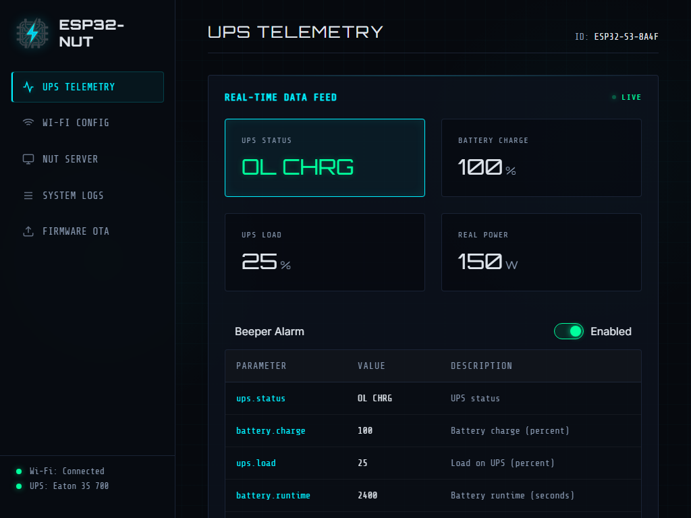
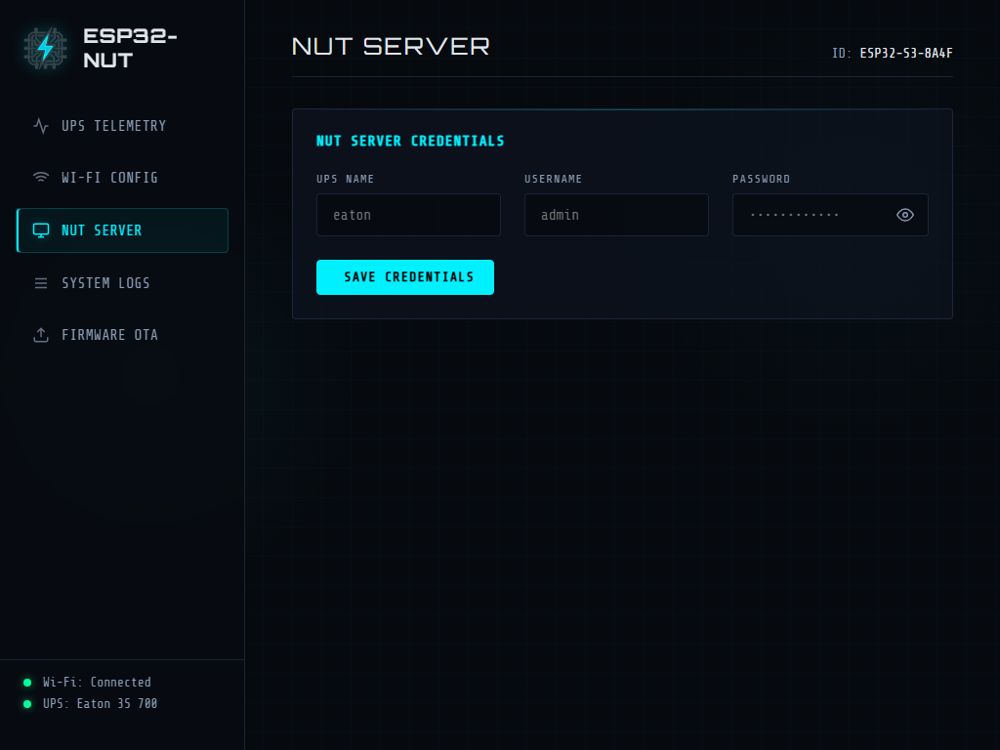
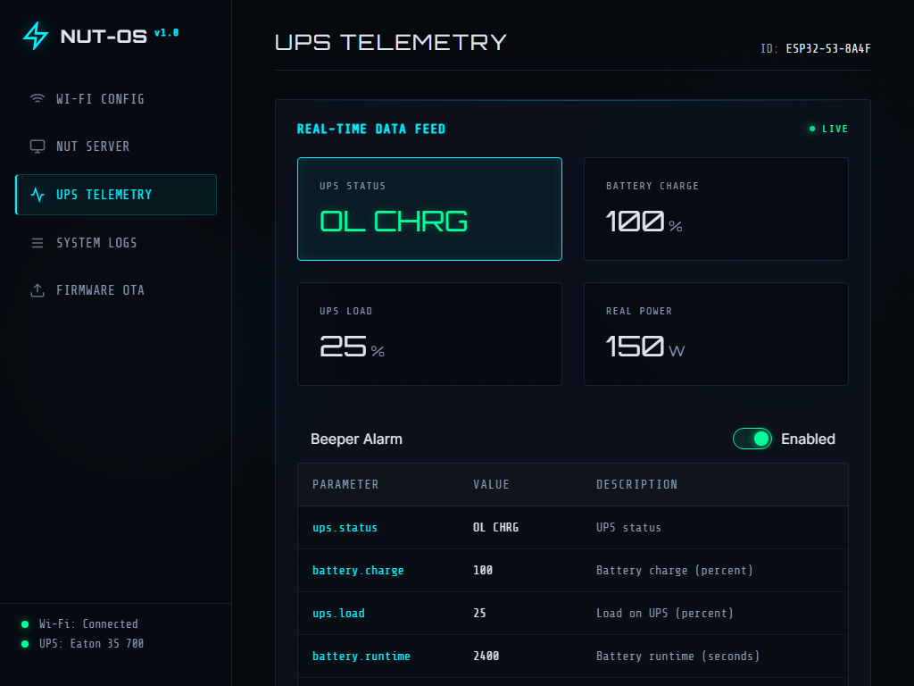
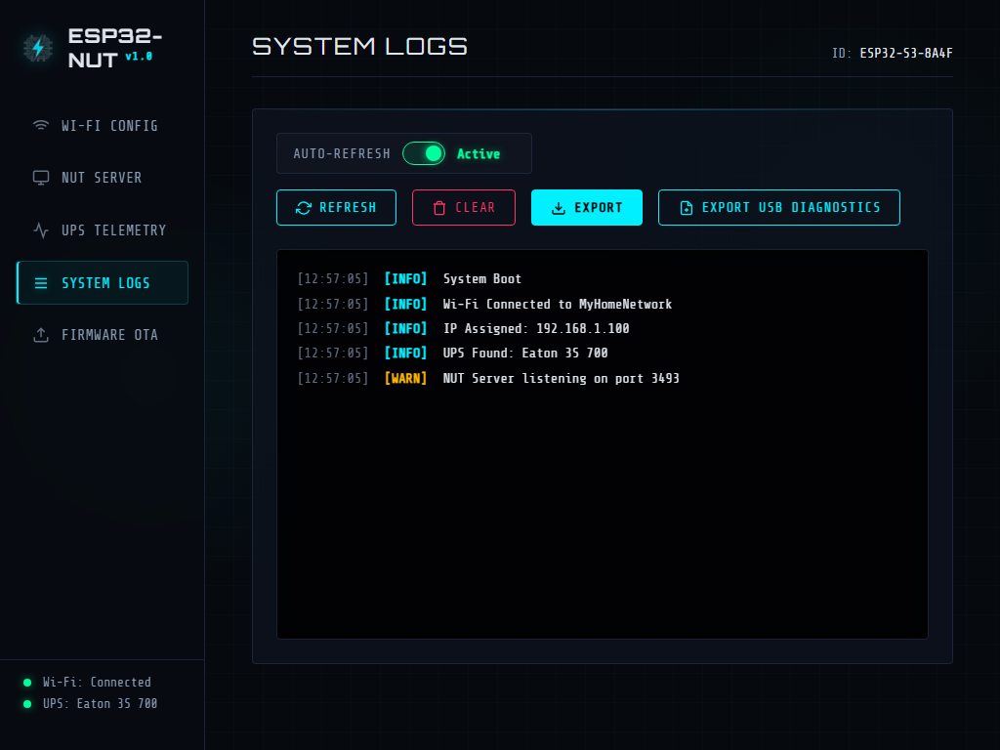
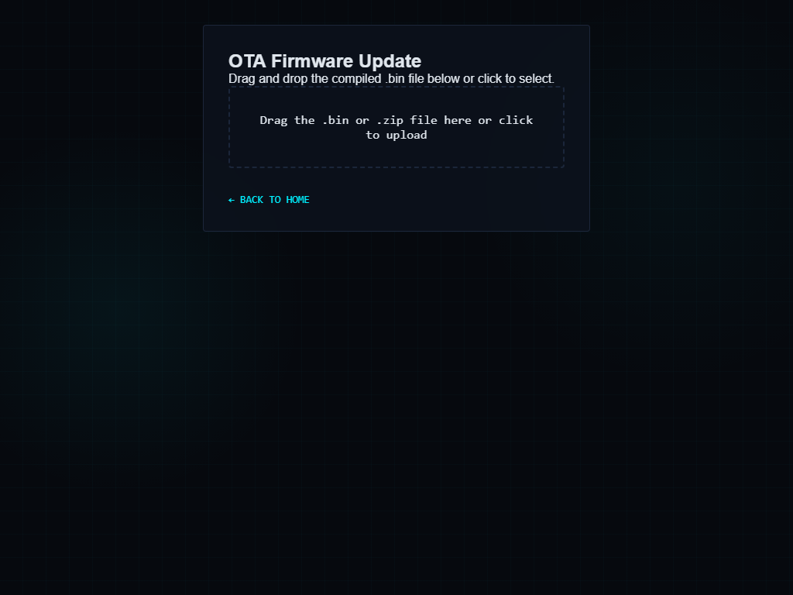

# ESP32 NUT Server Bridge 🔋

*🇬🇧 [Read in English](README.md)*

Un firmware open-source per ESP32-S3 che funge da **Server NUT (Network UPS Tools) bridge** standalone via Wi-Fi. Si connette a un gruppo di continuità (UPS) Eaton (come l'Eaton 3S 700) tramite USB Host e ne espone i dati sulla rete locale utilizzando il protocollo standard NUT (porta 3493) e un'interfaccia web integrata.

Questo progetto permette di integrare facilmente il tuo UPS (che magari dispone solo della porta USB) in sistemi come Home Assistant, TrueNAS, Synology o qualsiasi altro client NUT senza la necessità di tenere acceso un Raspberry Pi o un PC 24 ore su 24.

## 🌟 Funzionalità

- **Supporto USB Host Nativo**: Legge direttamente i dati HID dai dispositivi UPS compatibili via USB (testato con Eaton 3S).
- **Protocollo Server NUT**: Implementa il protocollo standard NUT, rendendolo immediatamente compatibile con i client NUT esistenti.
- **Interfaccia Web & Captive Portal**: Configurazione facile del Wi-Fi e delle credenziali NUT tramite una dashboard web moderna e responsiva.
- **Aggiornamenti Over-The-Air (OTA)**: Carica nuove versioni del firmware direttamente dal browser web senza collegare fisicamente la scheda al PC.
- **LED Diagnostico**: Feedback visivo immediato per lo stato della connessione Wi-Fi e del collegamento con l'UPS.

## 📸 Screenshot

| Configurazione Wi-Fi | Server NUT |
| :---: | :---: |
|  |  |

| Telemetria UPS | Log di Sistema |
| :---: | :---: |
|  |  |

| Aggiornamento OTA | |
| :---: | :---: |
|  | |

## 🛠 Requisiti Hardware & Cablaggio

- **Scheda ESP32-S3**: È **obbligatorio** utilizzare una scheda di sviluppo basata su ESP32-S3 poiché supporta l'USB OTG Host in modo nativo. I normali ESP32 o ESP32-C3 non funzioneranno.
- **Cavo USB OTG**: Un adattatore per collegare il cavo USB dell'UPS all'ESP32.

### Configurazione su Board generiche con doppia USB-C (es. Generic ESP32-S3 DevKit)
Molte schede generiche ESP32-S3 con due porte USB-C nascondono delle piazzole (solder pads) sul retro per abilitare la modalità Host. Per ottenere un'installazione pulita senza saldare manualmente fili ai pin GPIO:
1. **Saldare le piazzole "USB-OTG"**: Sul retro della scheda, trova le due piazzole denominate `USB-OTG` e uniscile con una goccia di stagno. Questo convoglia i 5V alla porta `USB`, permettendole di agire da Host per alimentare l'interfaccia USB dell'UPS.
2. **Saldare le piazzole "RGB"**: Unisci le piazzole `RGB` per abilitare il LED di stato integrato.
3. **Alimentazione**: Collega un alimentatore da muro alla porta etichettata `COM` (o `UART`).
4. **Dati**: Collega un adattatore USB-C OTG alla porta etichettata `USB` e collegalo all'UPS.

## 🚀 Guida all'uso

### 1. Caricare il Firmware (Flashing)
Il progetto è basato su [PlatformIO](https://platformio.org/).

1. Clona questo repository.
2. Apri la cartella del progetto in VSCode con l'estensione PlatformIO installata.
3. Collega il tuo ESP32-S3 al PC (utilizzando la porta USB UART/Prog).
4. Clicca su **Build** e poi su **Upload**.

### 2. Primo Avvio e Configurazione
1. Al primo avvio (o se non trova una rete Wi-Fi conosciuta), l'ESP32 creerà un Access Point chiamato **`NUT_ESP32_Config`** (Password: `12345678`).
2. Connetti il tuo telefono o PC a questa rete Wi-Fi.
3. Si aprirà automaticamente un Captive Portal. In caso contrario, naviga su `http://192.168.4.1`.
4. Inserisci le credenziali del Wi-Fi di casa e imposta un nome utente/password per il Server NUT.
5. Salva e riavvia.

### 3. Utilizzo Quotidiano
- Una volta connesso al Wi-Fi di casa, l'ESP32 otterrà un indirizzo IP dal tuo router.
- **Dashboard Web**: Naviga verso l'indirizzo IP dell'ESP32 nel tuo browser per vedere in tempo reale le statistiche dell'UPS (Batteria, Tensione, Carico, ecc.).
- **Client NUT**: Configura Home Assistant o il tuo NAS per connettersi all'IP dell'ESP32 sulla porta `3493` utilizzando le credenziali definite in precedenza.

## 📄 Licenza

Questo progetto è rilasciato sotto licenza MIT. Consulta il file [LICENSE](LICENSE) per maggiori dettagli.
