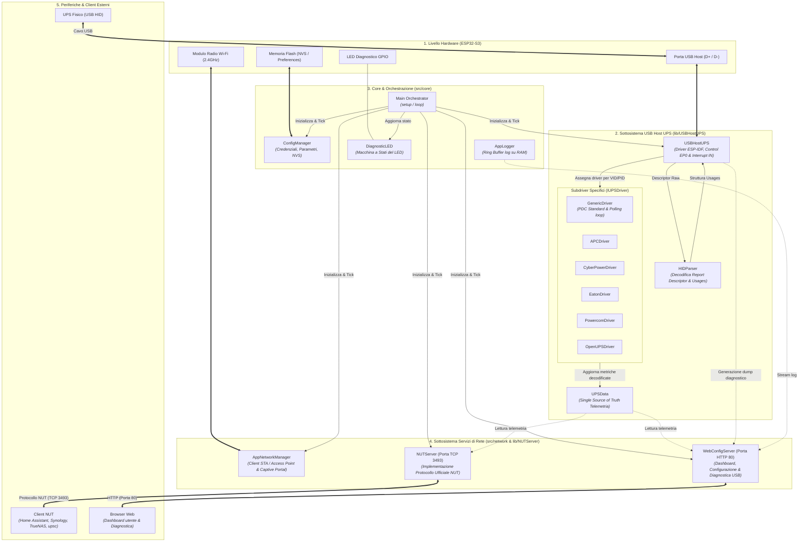
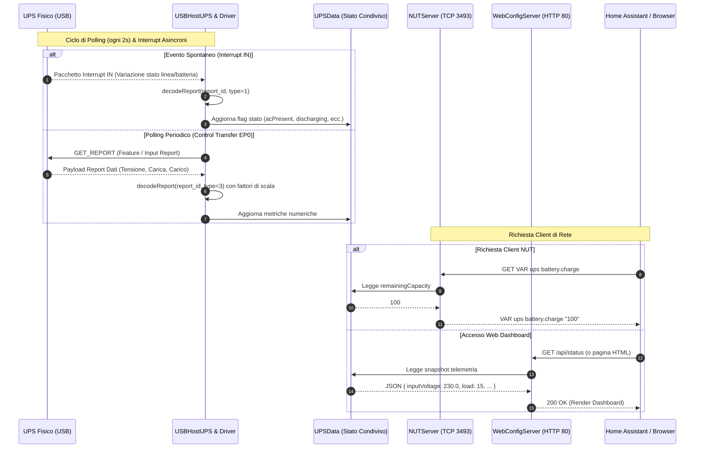

# Architettura Logica del Sistema ESP32-NUT

Questo documento descrive l'architettura software e logica del firmware **ESP32-NUT**, dettagliando i livelli funzionali, i flussi di dati e l'interazione tra i vari moduli.

---

## 1. Schema Architetturale Generale

---

## 2. Diagramma di Sequenza: Flusso di Polling & Rete

Il seguente diagramma illustra come i dati viaggiano dall'UPS fisico fino ai client di monitoraggio esterni (es. Home Assistant o interfaccia Web).

---

## 3. Descrizione Funzionale dei Livelli

| Livello | Responsabilità Principali | Componenti Chiave |
| :--- | :--- | :--- |
| **1. Hardware** | Connettività fisica USB Host, modulo radio Wi-Fi, pinout GPIO LED, memoria Flash non volatile. | ESP32-S3 SoC, NVS, GPIO LED |
| **2. USB Host & Driver** | Gestione stack USB host ESP-IDF, enumerazione periferiche, parsing alberi HID, elaborazione quirks, driver specializzati per marca/modello e memorizzazione telemetria. | `USBHostUPS`, `HIDParser`, `IUPSDriver`, `UPSData` |
| **3. Core & Orchestrazione** | Ciclo di vita applicativo, fallback fail-safe (Access Point / Station), log di sistema su ring buffer RAM e indicazione visiva tramite LED diagnostico. | `main.cpp`, `ConfigManager`, `AppLogger`, `DiagnosticLED` |
| **4. Servizi di Rete** | Gestione interfaccia di rete (Wi-Fi STA o SoftAP con Captive Portal), server conforme al protocollo Network UPS Tools (NUT) su TCP 3493 e Web Server di configurazione/diagnostica su porta 80. | `AppNetworkManager`, `NUTServer`, `WebConfigServer` |
| **5. Client Esterni** | Dispositivi UPS monitorati, piattaforme di domotica e automazione (Home Assistant), NAS (Synology, QNAP, TrueNAS), client CLI `upsc` e browser web dell'utente. | Client NUT, Dashboard Web, UPS |

